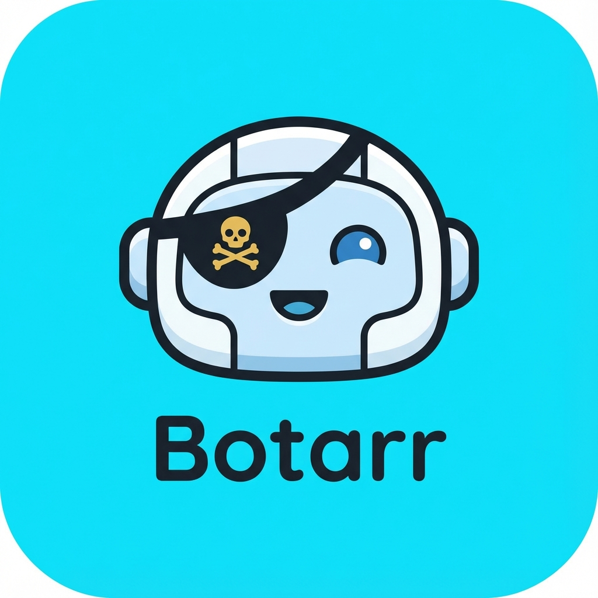

<p align="center">
  
</p>

# Botarr

<p align="center">
  <strong>The Ultimate Modern XDCC Manager</strong><br>
  <em>Built for speed, reliability, and visual excellence.</em>
</p>

<p align="center">
  
  
  
  
</p>

Botarr is a high-performance, self-hosted XDCC manager that brings a modern touch to a classic protocol. By combining a robust Rust backend with a sleek, responsive React frontend, Botarr provides a seamless experience for searching, queuing, and managing your XDCC transfers.

## Key Features

- **Smart Search**: Aggregated results from multiple providers with intelligent filtering and normalization.
- **Turbo Performance**: Asynchronous IRC client built with Rust for near-zero overhead.
- **Secure Connections**: Full SSL/TLS support for secure communication with IRC networks.
- **Privacy First**: Integrated SOCKS5 proxy support to keep your traffic anonymous.
- **Beautiful UI**: A clean, glassmorphism-inspired dashboard with real-time stats and progress tracking.
- **Power Settings**: Comprehensive web-based configuration for connections, identity, and behavior.
- **Docker-Ready**: Easy deployment with a tiny footprint.

## Quick Start

### Using Docker (Recommended)

The easiest way to run Botarr is using Docker Compose:

```yaml
# docker-compose.yml
services:
  botarr:
    build: .
    container_name: botarr
    ports:
      - "3001:3001"
    volumes:
      - ./downloads:/downloads
    environment:
      - RUST_LOG=botarr=info,api=info,xdcc=info
      - BOTARR_DOWNLOAD_DIR=/downloads
    restart: unless-stopped
```

```bash
docker compose up -d --build
```

Open `http://localhost:3001` to access the dashboard.

## Configuration

Botarr can be configured directly through the **Settings Tab** in the web interface or via environment variables:

| Variable | Description | Default |
|----------|-------------|---------|
| `BOTARR_DOWNLOAD_DIR` | Directory where files are saved | `./downloads` |
| `BOTARR_CONFIG_FILE` | Path to the persistent JSON config | `config.json` |
| `BOTARR_DB_PATH` | Path to the SQLite database | `botarr.db` |
| `RUST_LOG` | Log level (error, warn, info, debug) | `botarr=info` |

## Building from Source

### Prerequisites
- Rust (Cargo)
- Node.js & npm

### Steps
1. **Frontend**:
   ```bash
   cd web && npm install && npm run build
   ```
2. **Backend**:
   ```bash
   cd .. && cargo build --release
   ```
3. **Run**:
   ```bash
   ./target/release/botarr
   ```

## License

MIT License - see [LICENSE](LICENSE) file for details.

## Disclaimer

This project is for educational purposes only. The authors and contributors do not condone or encourage the use of this software for piracy or any other illegal activities. Users are responsible for complying with their local laws and regulations regarding the use of such tools.